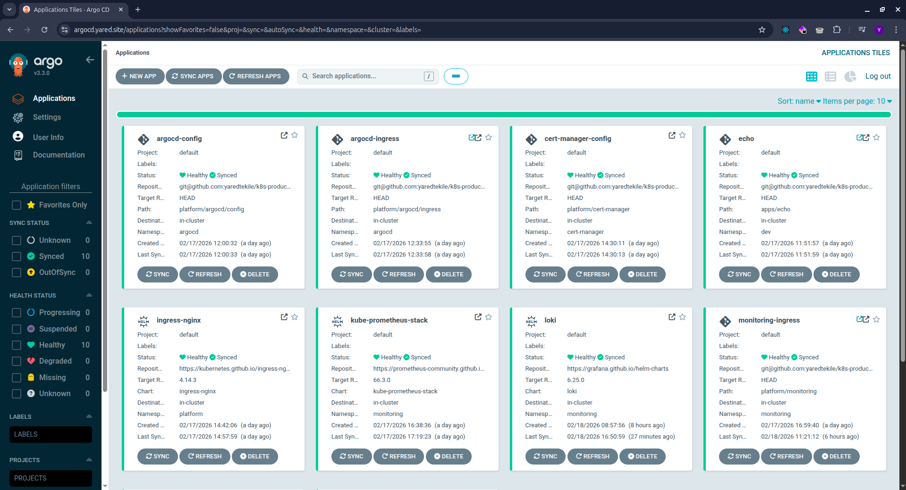
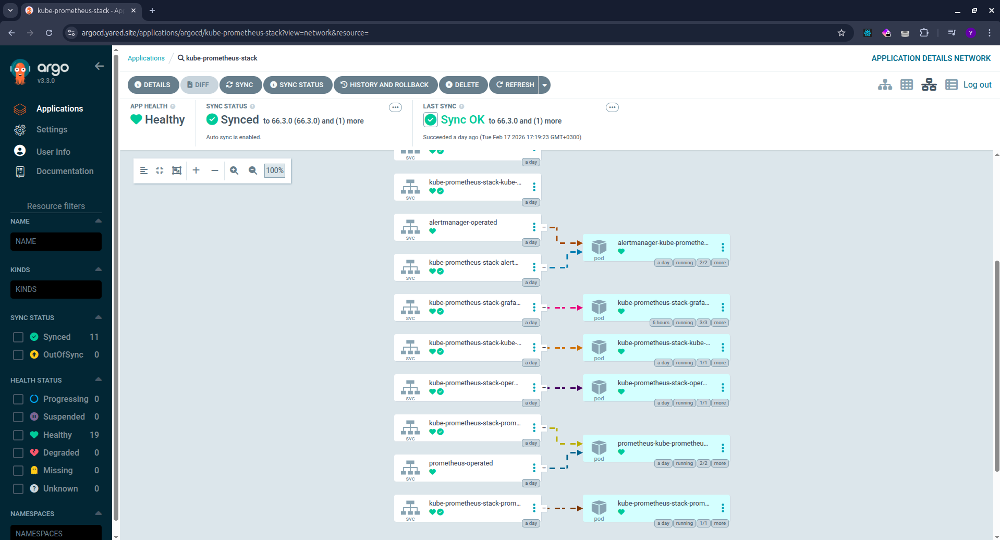
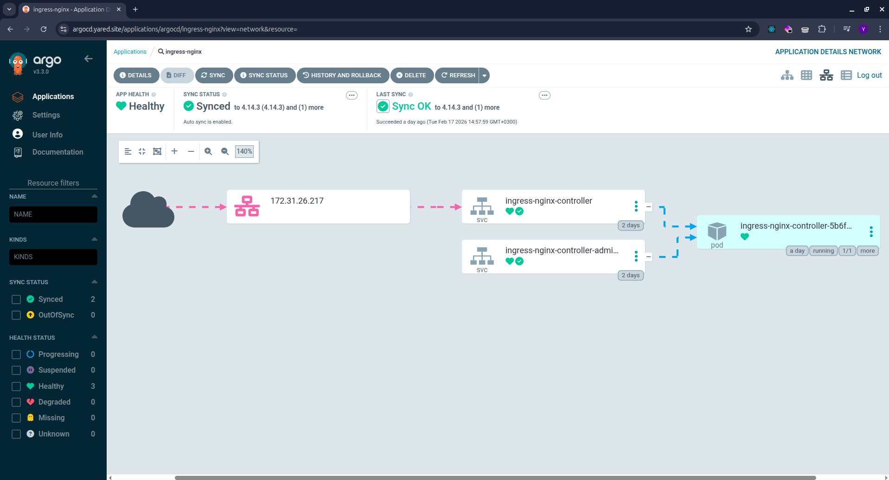
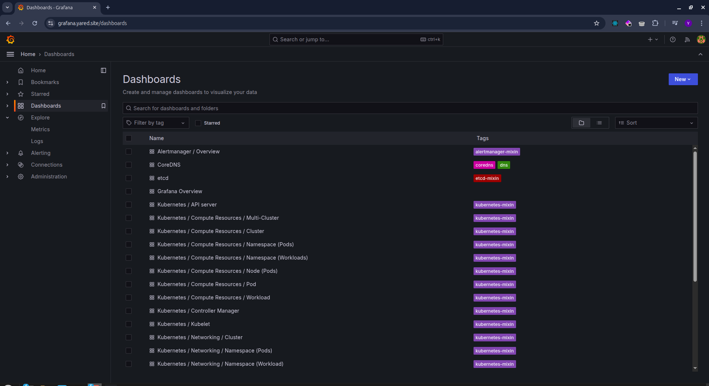
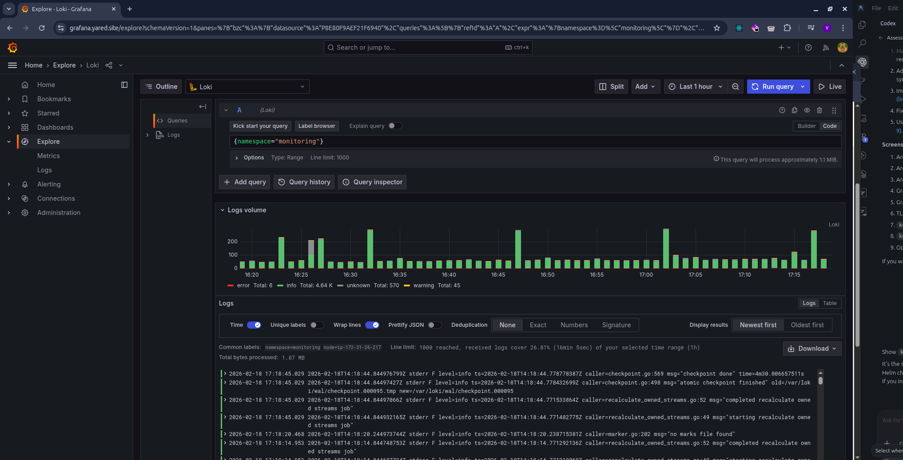
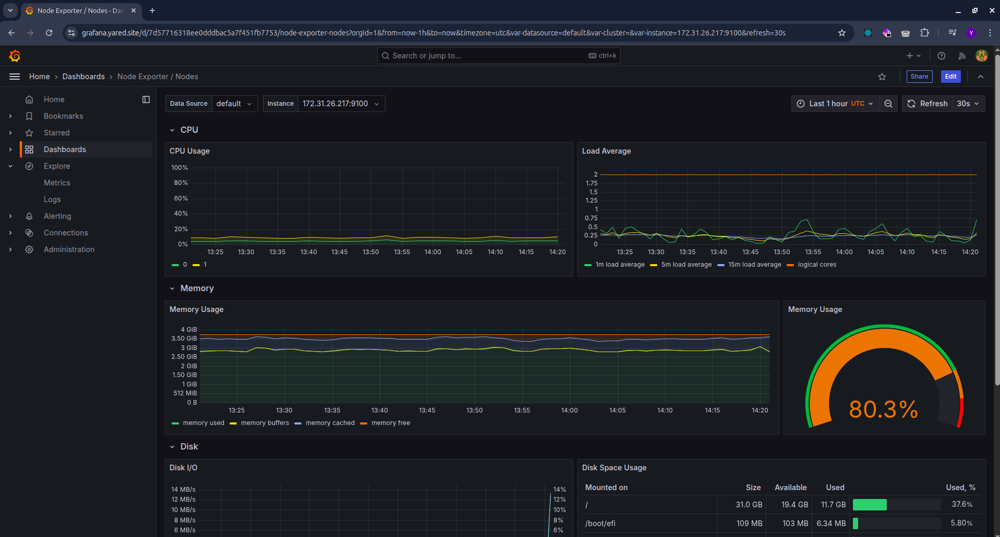
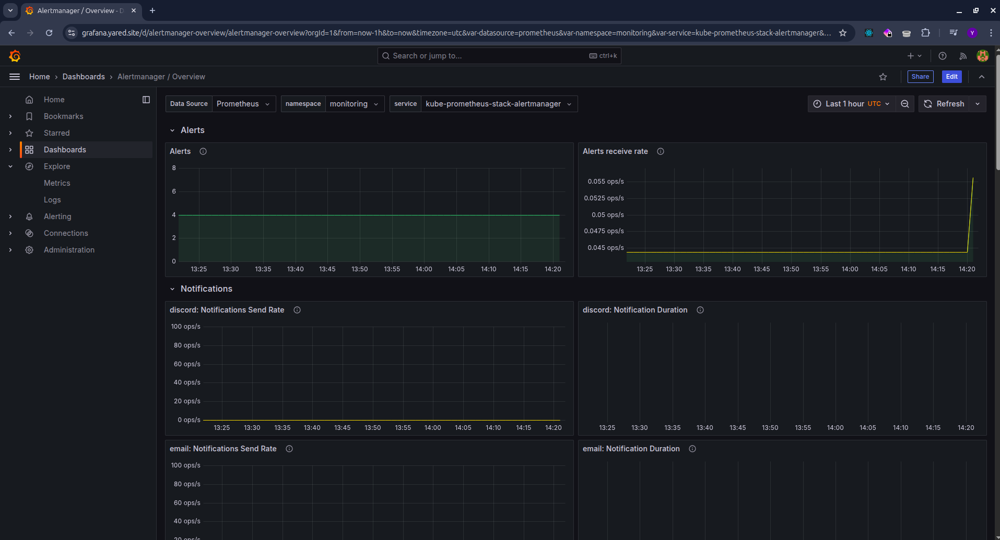
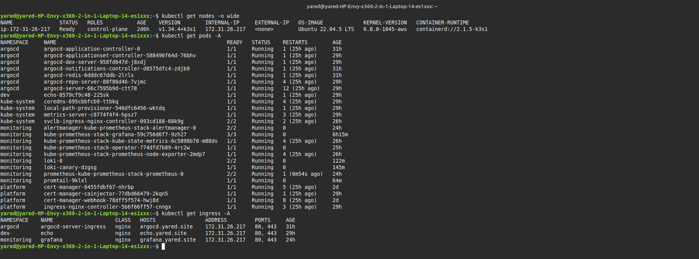
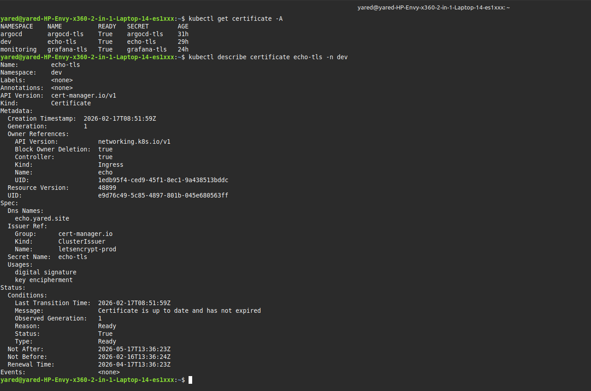

# Kubernetes Production Platform (AWS + K3s + GitOps)

Production-style Kubernetes platform running on AWS EC2 with K3s, fully managed through GitOps with Argo CD.

## Why This Project

This repository demonstrates how to build and operate a realistic DevOps/SRE platform with:

- declarative infrastructure (Terraform)
- declarative platform services (Argo CD App-of-Apps)
- ingress and TLS automation (ingress-nginx + cert-manager + Let's Encrypt)
- observability (Prometheus, Alertmanager, Grafana)
- centralized logging (Loki + Promtail)

## Architecture


Architecture details: `docs/architecture.md`

## Portfolio Highlights

- Real GitOps reconciliation model with automated sync, prune, and self-heal.
- Multi-app platform composition using Argo CD and Helm chart sources.
- TLS debugging and incident recovery documented in detail:
  `docs/ingress-controller-conflict-and-recovery.md`
- Monitoring and logging stack integrated end-to-end.

## Tech Stack

- Terraform (`infra/terraform/aws-k3s`)
- AWS EC2 (single-node host)
- K3s Kubernetes
- Argo CD (App-of-Apps pattern)
- ingress-nginx Helm chart `4.14.3`
- kube-prometheus-stack Helm chart `66.3.0`
- Loki Helm chart `6.25.0`
- Promtail Helm chart `6.16.6`
- cert-manager ClusterIssuers (staging + prod)

## Repository Structure

```text
.
├── apps/                  # Workload manifests (example app)
├── docs/                  # Architecture, standards, incident write-ups, screenshots
├── envs/                  # Environment strategy docs
├── infra/terraform/       # AWS infrastructure provisioning
└── platform/              # GitOps-managed platform services and config
```

## Bootstrap Flow (Current)

1. Provision EC2 infrastructure:
   `infra/terraform/aws-k3s`
2. Install K3s on the instance (Traefik disabled).
3. Install Argo CD in namespace `argocd`.
4. Bootstrap root application:
   `kubectl apply -n argocd -f platform/argocd/apps/root-app.yaml`
5. Argo CD reconciles platform and app manifests from this repo.

## Platform Proof (Screenshots)

### Argo CD





### Grafana + Loki






### Runtime + TLS Proof





## Useful Verification Commands

```bash
# Cluster state
kubectl get nodes -o wide
kubectl get pods -A
kubectl get ingress -A

# Certificate issuance
kubectl get certificate -A
kubectl describe certificate echo-tls -n dev

# TLS certificate proof
echo | openssl s_client -connect echo.yared.site:443 -servername echo.yared.site 2>/dev/null \
  | openssl x509 -noout -subject -issuer -dates -ext subjectAltName
curl -I https://echo.yared.site
```

## Key Documentation

- Architecture: `docs/architecture.md`
- Platform standards: `docs/platform-standards.md`
- Environment strategy: `docs/environment-strategy.md`
- Ingress + TLS notes: `docs/ingress-and-tls.md`
- Incident report: `docs/ingress-controller-conflict-and-recovery.md`

## Current Trade-offs

- Single-node cluster (cost-efficient, not HA)
- Some bootstrap steps are manual (K3s and Argo CD installation)
- Environment overlays (`envs/dev`, `envs/prod`) are documented and evolving

## Roadmap

- Add CI checks (YAML lint + Terraform validate + schema checks)
- Fully GitOps-manage cert-manager installation (not only issuer config)
- Add environment-specific overlays for dev/prod workloads
- Add policy and security hardening resources under `platform/security`

